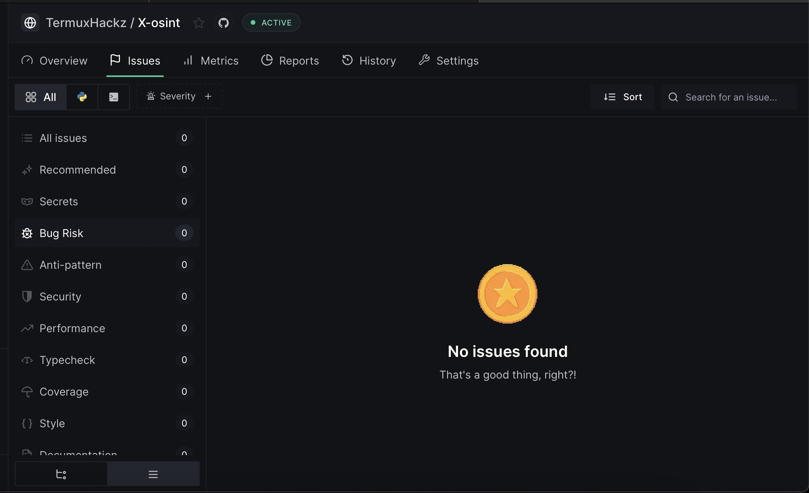
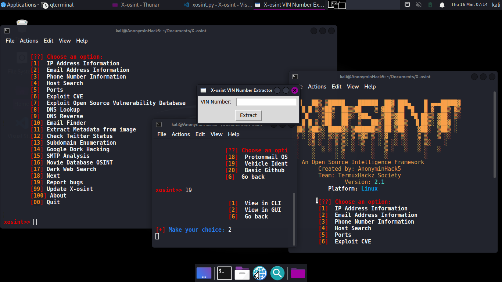
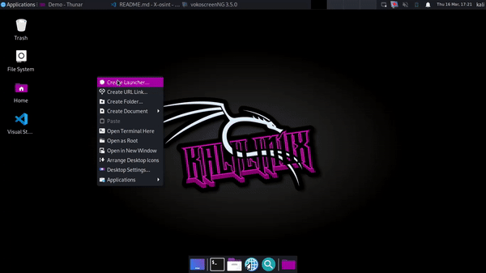

# X-osint
This is an osint tool which gathers useful and yet credible valid information about a phone number, user's email address and ip address and more to come in future updates 

<center>
<h2>
  
  
  
   
  
  </center>
  </h2>
  <hr>
  
  # Menu


# Bugs Report
X-osint version 2.2 has undergone a deepsource code analysis scan to check for Security Risks and Bugs Risks, which displayes that X-OSint is free from Bugs so far in Version 2.2, If you do have version 2.1 installed, Kindly Update to newer version for improved changed and bug fixes.

<br>
  # Features
  1) IP Address information gathering
  2) Email Address information gathering 
  3) Location MetaData Extraction from Image
  4) Host finding
  5) Ports finding
  6) Subdomain Enumeration
  7) CVE Exploits Finder
  8) Email Finder
  9) Exploit Open Source Vulnerability Database 
  10) DNS Lookup
  11) DNS Reverse
  12) Vin extractor
  13) Protonmail OSINT
  14) Check Global InfoStealer Attack
  15) Phone Number Information Lookup
  16) MetaData Extraction from any file
  17) Text Analysis
  And many more...

  <b>MANY OTHER FEATURES SOON TO COME </b>

# Report bugs
If you notice issues while installing this tool or running this tool kindly mail to me at <a href="mailto: AnonyminHack5@protonmail.com">Gmail</a> or Open an issue via github.

## Requirements 
[Python 3](https://www.python.org/downloads/)<br>
pip<br>
Internet Connection<br>
And some other python packages (alot)

<hr>

# How to Update Manually (For any version)
This tool would be updated regularly or as time progresses to improve it, fix more bugs and add so many other features, I would be showing you how to update it
<h5><u>How to Update For Termux</u></h5>
<b>ALSO TYPE THE DOLLAR SIGN </b>

#### 1) Type:
```
cd $HOME

cd $PREFIX/bin

rm xosint
```

#### 2) Re-clone from git:
```
cd $HOME

git clone https://github.com/TermuxHackz/X-osint

cd X-osint
```
#### 3) Grant permissions and run install file
```
chmod +x *

bash setup.sh
```
And your all done!!!..and updated 

<h3><u>How to Update for Linux</u></h3>
<b>ALSO TYPE THE DOLLAR SIGN </b>

#### 1) Type:
```
cd $HOME

cd /usr/local/bin

sudo rm xosint
```
#### 2) Re-clone from GitHub
```
cd $HOME

git clone https://github.com/TermuxHackz/X-osint

cd X-osint
```

#### 3) Grant permissions and run install file
```
chmod +x *

bash setup.sh
```

And your all done!!!..and updated 


# Demo Installation 
Here is a video demonstration below that shows how to install X-osint in your various terminal(s)

[](https://github.com/TermuxHackz/X-osint/blob/master/Demo/Install-Xosint.mp4)

<h5>Youtube Video Demo here</h5>
<a href="https://www.youtube.com/watch?feature=player_embedded&v=ikU1RHNVVuk" target="_blank">
  
</a>

# Installation 
```
sudo apt install python3-pip -y
cd $HOME
git clone https://github.com/TermuxHackz/X-osint
cd X-osint
chmod +x *
sudo bash setup.sh
sudo xosint OR python xosint
```
if your using Termux, Type the same commands from above without the "<b>sudo"</b> and replace "apt" commands to "pkg"

# Installation using python virtual environment if normal installation doesnt work
<p style="color: green"> The normal installation of Xosint might likely have some issues running or installing due to some missing python packages, use this method only if the normal installation and usage doesnt work!!
</p>

```
sudo apt install python3-pip python3-venv -y
cd $HOME
git clone https://github.com/TermuxHackz/X-osint
cd X-osint
chmod +x *.sh
python3 -m venv X-osint_venv
source X-osint_venv/bin/activate
pip install google
sudo bash setup.sh
sudo xosint OR python xosint

```
<p> <b>NOTE: Make sure you quit the python virtual environment after you have finished using Xosint by typing</b>:
<code>deactivate</code>
And then reactivate it anytime you want to use X-osint.</p>


# Creating a Python Virtual Enviornment to install for MacOS
python3 -m venv venv
## Activate using:
source venv/bin/activate
## Then RUn Script
## Deactivate the virtual Environment when done
deactivate

```
cd X-osint-fork
source X-osint_venv/bin/activate
sudo xosint
deactivate

```

## Optional:

You can copy X-osint to /usr/local/bin and remove the cloned repository.

```
cd X-osint
sudo cp -r xosint /usr/local/bin
cd /usr/local/bin && sudo chmod u+x xosint
cd $HOME && sudo rm -rf X-osint

```
<br><br>

# How to update Automatically (if your using version 2.1 of X-Osint and above)

<h4>For Termux</h4>

```
cd $HOME

xosint

And then from the menu Type 99 and proceed to selecting termux

```

<h4> For linux</h4>

```
cd $HOME

sudo chmod +x /usr/local/bin/xosint

sudo xosint

And from the menu Type 99 and proceed to selecting linux

```
# 🤝 Partnership
## X-Osint has also partnered with owner of the repo [tookie-osint](https://github.com/Alfredredbird/tookie-osint) to bring all of its OSINT tools into X-osint. This is to ensure a more Advance use of OSINT tools. New Features would continue to roll over

### How to use tookie-OSINT after installing it
<p style="color: white'">After installing X-osint, go to the NEXT tools option, then you should see tookie-osint and you can install</p>
<code>cd $HOME</code>

<h6>For Windows: </h6>
<code>python.exe brib.py</code>

<h6>For Linux/Mac:</h6>
<code>python3 brib.py</code>
<br>

<p>OR Launch tookie-osint from X-osint (Longer method though)</p>
<h3>

### 📌 NOTICE
</h3>
<p>If you are using the Subdomains feature and it ask for a word list, please download from <a href="https://www.mediafire.com/file/k60ooi301s4vkfo/subdomains.txt/file" target="_blank">here</a> and then extract the zip, make sure you know the location where it is kept, then proceed with using subdomain</p>

# 🔑 API Keys
Get your various API keys
#### 1) Shodan (https://shodan.io) (Number 4 - 9 from my tool will require a shodan API key, Sign up on shodan and paste your API and begin to use flawlessly)

#### 2) Hunter (https://hunter.io)

#### 3) Opencagedata (https://opencagedata.com): Use this for geolocation of numbers, And get your API from here <b>THIS WOULD BE REQUIRED IN PHONE NUMBER INFORMATION<+, SO SIGN UP AND GET YOUR API TO USE

#### 4) Google Search API Key (https://cse.google.com/cse): Use this for the ImageHunt OSINT feature in X-ossint <b>This is required for proper use of ImageHunt in X-soint</b>

#### 5) Google CLoud Console (https://console.cloud.google.com/apis/credentials)

#### 6) NumVerify (https://numverify.com/): Needed for the Phone number information to work

#### 7) Vonage API (https://dashboard.nexmo.com): Needed for Phone mumber information to work

<hr>

# How to create a desktop Launcher for X-osint in Linux
#### 1) Go to your home desktop, right click then click on Create Launcher
#### 2) Fill the field as follows

Name: X-osint

Comment: An osint tool made by AnonyminHack5 in python3

Command: sudo xosint

Working Directory: /usr/local/bin

Icon: Click the No icon button and add an icon, and then Go to my github, <a href="https://github.com/TermuxHackz/X-osint/tree/master/Icons">and download the .ico image there</a> then select that as your Icon and thats it

[](https://github.com/TermuxHackz/X-osint/blob/master/Demo/create-launcher.mp4)

<hr>


#### 3) For the Options
Tick 
- [x] Run in terminal

<hr>

```
Works for Termux and Linux/MacOS
Tested 
```

# License Plate OSINT
X-osint is able to fetch and provide information about a car license plate easily, which only works for license plates registered in the United States, States that this feature works for include: Alabama, Alaska, Arizona, Arkansas, California, Colorado, Connecticut, Delaware, Florida, Georgia, Hawaii, Idaho, Illinois, Indiana, Iowa and Distric of Columbia. KIndly note that this feature doesnt work for license plate registered in another country, how ever i may add such a feature but to do so i need encouragement hence, you supporting this project by Starring it and Buying me a cup of coffee. Thanks

# Google Dork Hacking
X-osint provides a way by which you can use Google for hacking once you know how to the particular search queries to perform, I have provided some useful google dork queries in this repo code, kindly view and use. Thank you.

# SMTP Analysis
X-osint is able to perform an SMTP Analysis and enumerate if an SMTP server is vulnerable or not

# VIN Number Identification
X-osint is able to gather information from a gov database and display the list or infos of vehicles based on their Identification numbers. X-osint is able to do that flawlessly without need for an API. VIN is available to use Via CLI or the GUI

# ProtonMail OSINT
Credits to pixelbubble, X-Osint is able to perform OSINT investigation on Proton service (for educational purposes only).  
ProtOSINT is separated in 3 sub-modules:
- [1] Test the validity of one protonMail account and get additional information
- [2] Try to find if your target have a protonMail account by generating multiple adresses by combining information fields inputted
- [3] Find if your IP is currently affiliate to ProtonVPN
- [4] Find a protonmail user PGP Key and download it right from your terminal
And so many More

# Demo protonmail OSINT
[](https://github.com/TermuxHackz/X-osint/blob/master/Demo/protonmail-xosint.mp4)


More features are still to come..Stay Tuned

# ChangeLogs for 2.3
- [1] Revamped Metadata Extraction to support any file type
- [2] Added DNSinf OSINT: For benchmarking and performance testing of DNS (Domain Name System) servers and giving you credible information
- [3] Added Text Analysis - powered by scapy for Fast and efficient NLP processing, Tokenization, POS tagging, NER, dependency parsing of texts.
- [4] Added Network Mapper - for WIFI Networks (IN BETA)
- [5] Added Disclaimer for using X-Osint
- [6] Other bugs fixes and improvements.


# ChangeLogs for 2.1.0
- [1] Fixed TKinter popup problem on start up


# ChangeLogs for 2.1
- [1] Fixed updating
- [2] Fixed Number 3 Option error
- [3] Changed Banner
- [4] Changed User interface
- [5] Added Features
- [6] Improved Speed
- [7] And thats about it, if you face any errors or bugs kindly mail them to me or open an Issue in github

## Changelogs
### Version 2.2
#### Critical Bugs Fixed
- [1] Fixed Issue where the python module folium wouldnt install
- [2] Fixed Issue where the python module numpy wouldnt install
- [3] Fixed Issue where the python module google-search wouldnt install
- [4] Fixed Issue where number 2 Option wouldnt work 
- [5] Phone number information is now in the "Next Menu"
- [6] Fixed issues where The 'SyntaxWarning' you're encountering is due to the use of invalid escape sequences in regular expression strings.


# Buy me a coffee
[](https://www.buymeacoffee.com/AnonyminHack5)<br>
Love my work and wish to support me, Buy me a coffee <a href="https://www.buymeacoffee.com/AnonyminHack5" target="_blank">here </a>

## Contributing
Feel free to clone this project. For major changes, please open an issue first to discuss what you would like to change or add, thank you!!.
DO NOT COPY CODE WITHOUT GIVING CREDITS :-

## Credits
Some of the modules here and APIs used for the creation of X-osint, got the idea from them, and so i would like to give them credit as most of the features of X-osint wouldnt be so without these mentioned Devs.
- [1] Pixellbubble
- [2] C3n7ral051nt4g3ncy
- [3] SpiderAnonGreyHat
- [4] [midnit3Z0mbi3](https://github.com/midnit3Z0mbi3)
- [5] [Cavalier-HudsonRock](https://cavalier.hudsonrock.com/docs)


# 📌 NOTE
For locating a phone number and getting the exact location, it is not exacly possible to get the exact location from a phone number, The Opencage module that serves to get location from a number doesnt exactly get the location per say 
<br>
<b>Here is what is actually happening:</b>

The phone number is entered and a library is used to turn the country calling code into the name of the country. For example numbers starting with +91 becomes India, +880 is Bangladesh, +34 is Spain, etc.

The country name is then sent to openCage geocoding API as a forward geocoding request (placename to coordinates). We then return the coordinates of the center of the country. For example we turn India into 22.3511148, 78.6677428, roughly in the middle of Uttar Pradesh.

People get confused and angry as to why the coordinates are not actually where the phone is physically located.

Unfortunately there is no such thing as magic, and neither we, nor anyone else, have the ability to derive a phone’s location from an input string like India or Spain.

If you want to know the location of a phone you need a service (application) running on the phone that has user permission to access the location from the operating system. How accurate the coordinates reported by the phone are will depend on which technology is used to determine the location (GPS, cell triangulation, wifi, etc). Once you have those coordinates you can then send them to opencage API as a reverse geocoding request. More info at https://opencagedata.com


# Faqs
## If your getting the error below which says 
 1) sudo xosint
Traceback (most recent call last):
File "/usr/local/bin/xosint", line 11, in
from googlesearch import search
ModuleNotFoundError: No module named 'googlesearch'
  

<u>Solution: </u> Kindly make sure you ran the `bash setup.sh` file and make sure you don't interrupt the setup process and after you run that, and doesnt still work type `pip install google` and re run xosint.
  if your still having issue with it run `pip install googlesearch-python` and run xosint. That should solve your problem with xosint. Thank you and share to friends.
<br>

2) Having an npm error when installing eslint?<br>
<u>Solution: </u>Type <code>curl -o- https://raw.githubusercontent.com/nvm-sh/nvm/v0.39.1/install.sh | bash </code>
Then type <code>source ~/.bashrc</code> OR <code></code>source ~/.zshrc</code>
<br>
Then type <code>nvm install node</code><br><code>nvm use node</code><br><code>nvm alais default node</code><br><code>npm cache clean --force</code><br>
Then install eslint again: <code>npm install -g eslint</code>


  
