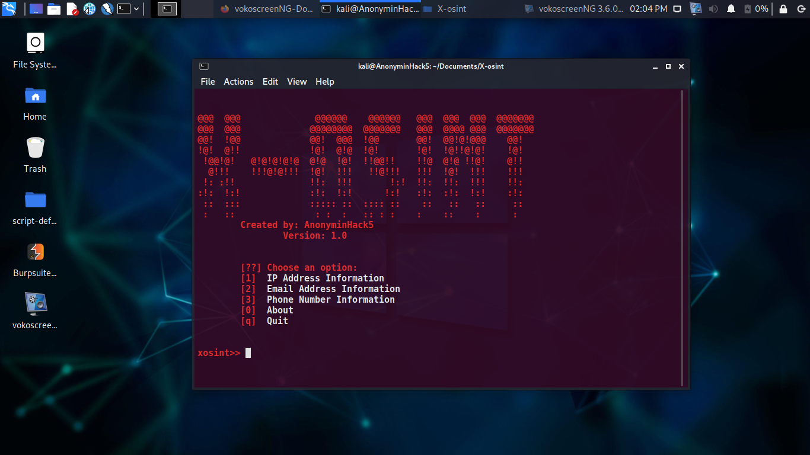

# X-osint
This is an osint tool which gathers useful and yet credible valid information about a phone number, user's email address and ip address and more to come in feature updates 
<h2>
  
  
  
  
  </h2>
  <hr>
  
  # Features
  ```
  1) IP Address information gathering
  2) Email Address information gathering 
  3) Phone number information gathering 
  ```
  <b>MANY OTHER FEATURES SOON TO COME </b>

# Report bugs
If you notice issues while installing this tool or running this tool kindly mail to me at <a href="mailto: AnonyminHack5@protonmail.com">Gmail</a> or Open an issue via github.

## Requirements 
```
python-3
pip
Internet Connection
``` 
<hr>

# Installation for Termux
```
cd $HOME
git clone https://github.com/TermuxHackz/X-osint
cd X-osint
chmod +x *
bash setup.sh
```

# Installation for Linux
```
cd $HOME
git clone https://github.com/TermuxHackz/X-osint
cd X-osint
chmod +x *
bash setup.sh
python3 xosint.py

# Demo


```
Works for Termux and Linux 
Tested 
```


  
