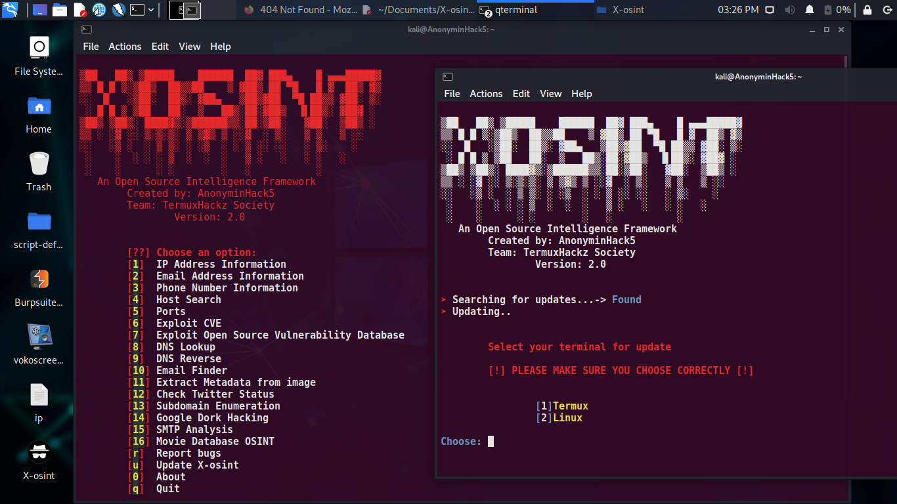

# X-osint
This is an osint tool which gathers useful and yet credible valid information about a phone number, user's email address and ip address and more to come in feature updates 
<h2>
  
  
  
  
  </h2>
  <hr>
  
  # Features
  ```
  1) IP Address information gathering
  2) Email Address information gathering 
  3) Phone number information gathering 
  4) Host finding
  5) Ports finding
  6) Subdomain Enumeration
  7) CVE Exploits Finder
  8) Email Finder
  9) Exploit Open Source Vulnerability Database 
  10) DNS Lookup
  11) DNS Reverse
  And many more...
  ```
  <b>MANY OTHER FEATURES SOON TO COME </b>

# Report bugs
If you notice issues while installing this tool or running this tool kindly mail to me at <a href="mailto: AnonyminHack5@protonmail.com">Gmail</a> or Open an issue via github.

## Requirements 
```
python-3
pip
Internet Connection
``` 
<hr>

# How to Update Manually
This tool would be updated regularly or as time progresses to improve it, fix more bugs and add so many other features, I would be showing you how to update it
<h5><u>How to Update For Termux</u></h5>

#### 1) Type:
> cd $HOME

> cd $PREFIX/bin

> rm xosint

#### 2) Re-clone from git:
> cd $HOME

> git clone https://github.com/TermuxHackz/X-osint

> cd X-osint

#### 3) Grant permissions and run install file
> chmod +x *

> bash setup.sh

<b>And your all done!!!..and updated </b>

<h3><u>How to Update for Linux</u></h3>

#### 1) Type:
> cd $HOME

> cd /usr/local/bin

> sudo rm xosint

#### 2) Re-clone from GitHub
> cd $HOME

> git clone https://github.com/TermuxHackz/X-osint

> cd X-osint

#### 3) Grant permissions and run install file
> chmod +x *

> bash setup.sh

<b>And your all done!!!..and updated </b>


# Installation for Termux
```
cd $HOME
git clone https://github.com/TermuxHackz/X-osint
cd X-osint
chmod +x *
bash setup.sh
```

# Installation for Linux
```
cd $HOME
git clone https://github.com/TermuxHackz/X-osint
cd X-osint
chmod +x *
bash setup.sh
```
# How to update Automatically (if your running version 2.0 of X-Osint)

<h4>For Termux</h4>

```
cd $HOME

xosint

And then from the menu Type "u" Without the quotes

```

<h4> For linux</h4>

```
cd $HOME

sudo xosint

And from the menu Type "u" without the quotes

```

<h3>
NOTICE
</h3>
<p>If you are using the Subdomains feature and it ask for a word list, please download from <a href="https://www.mediafire.com/file/k60ooi301s4vkfo/subdomains.txt/file" target="_blank">here</a> and then extract the zip, make sure you know the location where it is kept, then proceed with using subdomain</p>

# API
Get your various API keys
#### 1) Shodan (https://shodan.io) (Number 4 - 9 from my tool will require a shodan API key, Sign up on shodan and paste your API and begin to use flawlessly)

#### 2) Hunter (https://hunter.io)

<hr>

# How to create a desktop Launcher for X-osint in Linux
#### 1) Go to your home desktop, right click then click on Create Launcher
#### 2) Fill the field as follows
```
Name: X-osint

Comment: An osint tool made by AnonyminHack5 in python3

Command: sudo xosint

Working Directory: /usr/local/bin

Icon: Click the No icon button and add an icon of your choice 
```
#### 3) For the Options
Tick 
- [x] Run in terminal

# Menu


<hr>

```
Works for Termux and Linux 
Tested 
```
# Demo

# Google Dork Hacking
X-osint provides a way by which you can use Google for hacking once you know how to the particular search queries to perform, I have provided some useful google dork queries in this repo code, kindly view and use. Thank you.

# Movie Database
X-Osint uses the lastest information from IMDB To give search results based on you choice of options to give you information on Actor, Movie Name, Keyword names, Company name of the Movie, and also check if the actor was starred in the Movie or not

# SMTP Analysis
X-osint is able to perform an SMTP Analysis and enumerate if an SMTP server is vulnerable or not

More features are still to come..Stay Tuned


> Fixed Bugs
```
Fixed updating

Fixed Number 3 Option error

Changed Banner

Changed User interface

Added Features

Improved Speed
```


# Buy me a coffee

Love my work and wish to support me, Buy me a coffee <a href="https://www.buymeacoffee.com/AnonyminHack5" target="_blank">here </a>


  
